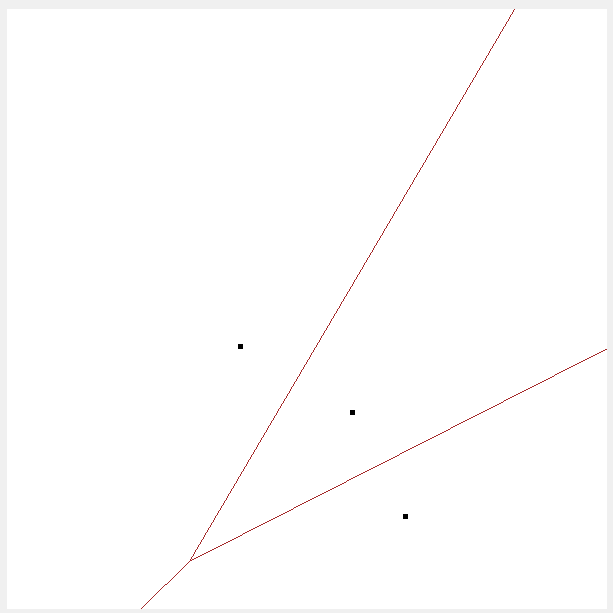

# Voronoi diagram with divide and conquer

## 軟體規格書
### 輸出與輸入（資料）規格
**輸入:**
* 讀取輸入點的txt檔
* 手動輸入點至程式的資料輸入區
* 點擊繪圖區，自動記錄點
* 讀取圖形結果的txt檔

**輸出:**
* 輸出每次畫出來的圖形結果，以點和線段來表示，即圖形結果的txt檔

**兩種txt檔的規格:**
輸入點的txt檔內規格如下:
使用#可讓那行不被讀取
一個測試案例包含第一行為總共點數，之後分別為各個點的x和y座標
允許在同一txt放入多個測試案例
一個測試案例的範例如下:
```
3
200 250
312 284
147 390
# comment here
```

圖形結果的txt檔規格如下:
先輸出點，以P來表示，後面為點的x和y座標值
後輸出線段，以E來表示，後面為線段的兩端點的x和y
全部點之間以lexical order進行排序
線段兩端點以lexical order進行排序
全部線段之間先以第一點進行lexical order排序，若第一點相同，則利用第二點
進行排序後，才會輸出成圖形結果檔，而讀取的圖形結果檔則不用為排序好的情況
範例如下:
```
P 67 307
P 159 448
P 224 311
P 357 174
P 416 368
E 0 450 142 357
E 100 0 148 105
E 142 357 148 105
E 142 357 293 429
E 148 105 335 286
E 293 429 335 286
E 293 429 346 600
E 335 286 600 205
```


### 功能規格與介面規格
#### 基礎視窗模樣

#### 詳細功能和介面介紹

整個視窗為固定大小
* 畫布
進行任何相關的圖形繪製，大小為600x600，左下角為0,0，往右為x的正向，往上為y的正向
* 步步執行
若有發生divide，則會展示merge前的圖形，情況並畫出相關convex hull和hyper plane
* 狀態顯示區
用來及時顯示滑鼠位於畫布上的座標位置，或用以顯示讀檔錯誤
* 選擇檔案
可以瀏覽電腦內部檔案，並找尋想要的txt檔，讀取並填入資料區
* 一般執行
將資料區的資料根據模式的不同進行執行
* 清除畫布
將畫布清除，並將重置資料區讀取測試案例的進度
* 模式切換
分為三種模式可切換
    1. input: 為根據點繪製voronoi diagram的模式，此時資料區的資料應如同輸入點的txt檔的規格
    2. output: 為將圖形結果進行繪製voronoi diagram的模式，此時資料區的資料應如同圖形結果的txt檔規格
    3. manual: 允許手動點擊畫布決定點的模式，並依照那些點繪製voronoi diagram，此時資料區不影響執行
* 資料區
不論為何模式，執行的輸入資料總是根據資料區，若放錯資料類型會導致執行錯誤，也可手動輸入想要測試資料

#### 實際執行情況
* 讀取檔案
點擊choose file選擇想要的txt檔讀入input區


* input模式的一般執行


* input模式的步步執行
此時左右的Voronoi diagram和convex hull分別都用不同顏色標示，合併後得convex hull則以塗色面積來表示，hyper plane也明確標示出來


* output模式的執行


* 當執行時，資料區的格式不小心不符合當前模式
狀態會顯示error


* manual模式
此時可以直接在畫布上點出點的位置，資料區的資料不會影響執行。此模式只能進行一般執行
**先點擊需要的點**

**點擊run進行一般執行**


* 輸出的檔案會放在與exe同資料夾下


### 軟體測試規劃書
根據點的數量可以進行不同測試
* 1~3點: 不會進行divide
* 4~6點: 進行一次divide和merge
* 7點以上: 進行多次divide和merge

## 軟體說明
使用C#作為開發語言，並且使用windows .Net Core 3.1版本的framework([官方下載點](https://dotnet.microsoft.com/zh-cn/download/dotnet/thank-you/runtime-desktop-3.1.32-windows-x64-installer?cid=getdotnetcore))，並須安裝其相關套件才能執行本專案程式的exe檔案(exe檔並須有相關檔案(dll,json)在同一資料夾下才能執行，如下圖)


## 程式設計
### 主要使用的資料結構
#### C#提供的資料結構
Point: 包含兩個值X和Y，可以運用在向量或是座標點
#### 自訂的資料結構(class)


Edge: 包含一個長度為2的Point陣列，表示線段兩端，以及額外兩個Point(n1&n2)，兩個額外的Point必要時(即這個實例為中垂線時)，儲存是哪使用兩點產生這個(中垂線)線段的。可以運用在一般線段或是Voronoi diagram的線段上

### Divide and conquer演算法流程


1. 檢查點的數量是否大於3，決定是否divide
2. 是，則進行divide，並遞迴呼叫DaC()，完成後會進行merge
3. 否，則直接進行含3點以下Voronoi diagram繪製，並分配一種顏色來繪製
step則是用來控制是否要畫到最後

### 繪製含三點以下Voronoi diagram
一般來說，如果是三點可形成三角形時，可以利用三角形的外心，由於會牽涉到有關於除法的公式，若三點共線可能，發生除以零得情況
所以首先得先排除一些特例，避免在計算外心上的計算問題
#### 兩點
直接針對兩點畫中垂線即可

#### 三點共線
透過點之間的向量比值或全部點的座標X或Y相同即可辨別，只需要畫兩條線，因此，只要有排序點之後，在將相鄰點畫中垂線即可

#### 三點可形成三角形
首先得先得出外心，可透過如下公式計算，且只取整數部分進行繪製
外心公式分別得出外心的x和y:


得出外心後便能利用每兩點的向量之垂直向量延伸出Voronoi diagram的邊，但由於向量會有兩個方向，因此，這裡透過逆時針取向各兩點的向量來找垂直向量，這樣就能確保方向是由三角形往外

### divide
因為點已經過排列，因此讓點的陣列中前一半一組，剩下的一組即可分出左右

### merge細節
merge內可分為兩步驟:一是找上下切線，二是找出hyperplane

#### 步驟一:找上下切線
首先要有左右的convex hull，但由於採用divide and conquer，我們最多也只會需要找3點的convex hull，然而，3點以上的convex都會經過merge的步驟，因此，只要merge正確，那就把merge的convex hull結果保存即可。總而言之，我們不需要額外的演算法來找convex hull。
有左右的convex hull，便能開始找上下切線，但要先將兩邊的點各自以逆時針排序(只有三點以下的情況會需要排，不然merge後，都會是排好了)，方便之後步驟使用，如果要找上切線，其步驟如下:
1. 首先針對左邊的convex hull先找最右(X值最大)的點，針對右邊的convex hull先找最左(X值最小)的點
2. 透過從兩點開始可以建立一射線
3. 檢查射線是否穿過右convex hull? 是，則將射線右點，以順時針找下一點，且回到步驟3。否，繼續下一步
4. 檢查射線是否穿過左convex hull? 是，則將射線左點，以逆時針找下一點，且回到步驟3。否，繼續下一步
5. 若到這步表示，這個射線是沒穿過左右的convex hull並保持是往上找的，符合上切線
而若要找下切線則只需要把步驟3和4的順逆時鐘方向對調即可得出不同的步驟5結論。

實際範例如下:


數字代表線的檢查順序

此外，還需要確保如何知道線是否穿過convex?
這裡使用比較點之間的向量的旋轉角度得知。
例如如果是要找上切線時，檢查是否穿過右邊convex hull，那就要比較左點到右點的向量，以及左點到右邊的(順時針)下一點的旋轉角度是否為逆時針?是，代表這條有穿過右convex hull。否，則代表沒穿過
向量角度方向公式如下:
```
有兩向量v1(X,Y) v2(X,Y)，計算由v1轉到v2(會以轉比180度小的那方向為準)
result = v1.X * v2.Y - v1.Y * v2.X 
result > 0 為逆時針
result = 0 為平行
result < 0 為順時針
```

實際範例如下:


字母代表點
假設為找上切線，根據先前描述的步驟，則此時要若要檢查射線AB是否有穿過右convex hull，則應比較從A到B的向量，以及從A到C的向量是否為逆時針旋轉?計算可得出，答案為是，代表AB穿過右convex hull。因此，根據先前描述的步驟，在右convex hull找下一點C來進行步驟3，檢查射線AC是否有穿過右convex hull，則應比較從A到C的向量，以及從A到D的向量是否為逆時針旋轉?計算可得出，答案為否，代表AC沒有穿過右convex hull，則進入步驟4...以此進行。

**這裡在實作時必須注意是在檢查穿過左還是右convex hull，以及是在找上或下切線，這些都會影響是要用順時針還是逆時針的問題(Ex:下一點在順還是逆，旋轉是順還是逆)**

透過上述步驟找上下切線，可以確保找到3點以上的convex hull，這時，只要透過把那些外面點收集起來，即可得知merge後的convex hull，便能給之後的merge使用，如此便能，跟先前提到的一樣，不用額外演算法找convex hull
收集merge後的點的方法為先從某切線的點開始，假設是從上切線的左端點開始，則利用這個點逆時針收集左convex hull點直到下切線的左端點時，再從下切線的右端點開始逆時針收集右convex hull點直到上切線的右端點


#### 步驟二:找hyperplane
有了上下切線後，可以利用第一條切線作為hyperplane的起始位置。這裡就可以使用到Edge資料結構中的n1和n2來輔助尋找hyperplane，首先透過第一條切線線段取中垂線，起始點可越遠越好，並且延伸方向一定不會是往上(而是水平或往下)，直到碰到其他已存在的Voronoi diagram的線上，此時可發現，碰到的線以及當前的hyperplane必有同一個相同兩側的點(n1 or n2)，此時便把該點捨去，剩餘兩點便能做出新的hyperplane，一直如此，直到做出hyperplane的兩點恰為下切線的兩點代表可以結束
hyperplane也使用了Edge的資料結構

實際範例如下:


假設重頭開始畫中間的hyperplane，由merge的convex hull結果，可看出AD為上切線，此時可以AD中垂線為第一部份的hyperplane並由很遠往下延伸，直到碰到了Voronoi diagram上的線段(即DF線段畫出的中垂線)，此時，透過Edge資料結構內的n1 n2可知，其為D和F構成的中垂線，跟當前hyperplane的n1 n2(為A和D)比較，發現都有D，則取不重複兩點(A和F)來建構下一段hyperplane，起點則為剛剛上一個hyperplane的交點以此進行，直到發現取的兩點為下切線的兩點(F和C)即可做完


**這裡實作判斷線碰到的方法**，則是找交點，使用了找交點公式，由於公式是用於射線之間的找交點，因此還要確保交點是有在線段上的才行，讓hyperplane跟所有Voronoi diagram 上的線找交點，以先碰到的為準(通常是Y值最大的)。

此外，**要做的另一件就是消線**，這裡在進行尋找hyperplane的下一交點，找到時便要順便進行消線，這裡透過旋轉的方向進行決定要消除哪段線，首先透過從本來的hyperplane和新找到的hyperplane的方向進行旋轉角度計算，若為逆時針，則要消根據原方向也位於逆時針方向的線，反之亦然。
實際範例如下:


由H0延伸到，發現了H1交點，同時先尋找下一交點，找到了H2，此時，便可進行消線，由H0到H1的向量以及H1到H2的向量，利用向量角度方向公式，便可得知是往逆時針轉，因此需要消除位於逆時針的那側，這時再利用H0到H1的向量分別和H1到M和H1到N比較，可知H1到M是在逆時針方向，因此，針對撞到的線的Edge資料結構更改其端點，將M改成H1，這樣之後就只會畫N到H1，便能完成消線。

### Step by Step
實作的辦法只是把最後結果不要先畫出來，只先將中間畫出來的方式來進行呈現


## 軟體測試與實驗結果


### 執行環境
#### 電腦硬體


### 3點內測試





### 4~6點測試


### 7點測試以上
由於先前已知問題，這邊測試都無法通過，且會造成錯誤導致程式無法執行


### 實驗結果
6點內的大多情況下，都能正常運作，但一旦發生，交點出現在外的情況，便會畫錯

### 實作上已知問題
#### hyperplane找交點問題
由於，在實作3點以下的Voronoi diagram時，只讓其線段的端點最多取到畫布邊緣，因此，這會造成一些在未來merge時，若發生Voronoi diagram線段跟hyperplane交會在畫布外時，會因而判定為沒有交點，因為並不再限制的兩端點內，這部分與上方所述的判斷線碰到的方法有牴觸，造成程式有點難修改，因此只有針對，後面的hyperplane進行修改，若如果hyperplane要延伸到Y為0以下之後則不用繼續找交點，這樣可以避免掉一部分的圖形問題。

#### 衍生問題
由於只要點一多，變容易發生交會在在外面的情形發生，而且只要找錯交點，變無法正常進行hyperplane繪製，因此，本程式只能寫了進行一次divide和merge的divide and conquer，因此，最多只能用在6個點Voronoi diagram的情況下

## 結論與心得
這次Voronoi diagram的divide and conquer實作可謂相當充實，之前在第一次接觸Voronoi diagram的相關演算法時，其實，對於這個演算法是相當陌生的，也不了解其中用途與細節。這次實作開始時，搭配上課時留下的筆記，總算是徹底了解了，這個演算法的奧妙。然而，理解後再來實作，卻又是另一回事，很大一部分原因是，電腦在處理圖形上，不像人腦那麼直覺，必須講求實際數值、數學方法與邏輯，這些缺一不可，其中有許多麻煩的問題需要解決，例如:如何確定線是否交會、線是否串過convex hull，這些問題都必須找到對應的數學方法，我認為這是這次最難的部分。此外，在實作時，可能也必須考慮周全，了解之後可能會遇到的需求，才不會發生如我上述遇到的畫布外交會問題。

## 附錄
### [程式專案原始碼Github](https://github.com/BlueLancaster/BlueLancaster-Voronoi-diagram-with-divide-and-conquer)

### 參考資料
[交點相關公式](https://web.ntnu.edu.tw/~algo/Point.html)

[向量轉向公式](https://www.twblogs.net/a/5ede17e64cdc70db8474a309)

[外心公式](https://www.cnblogs.com/BlairGrowing/p/13922606.html)

### 測試輸入檔
<details>
    
    #雙點測試
    2
    289 290
    342 541
    #雙點測試 水平
    #2
    #200 200
    #400 200
    #雙點測試 垂直
    #2
    #200 200
    #200 400
    #雙點測試 重覆
    2
    200 200
    200 200
    #=============================================================================
    #三點測試 水平
    3
    200 200
    300 200
    400 200
    #三點測試 垂直
    3
    200 200
    200 300
    200 400
    #三點測試 直角三角形
    3
    200 200
    300 200
    200 300
    #三點測試 銳角三角形
    3
    147 190
    164 361
    283 233
    #三點測試 鈍角三角形
    3
    398 93
    233 263
    345 197
    #三點測試 y=2x 三點共線
    3
    10 20
    20 40
    200 400
    #三點測試 x=4y 三點共線
    3
    4 1
    100 25
    400 100
    #=============================================================================
    #四點測試 正方形
    4
    100 200
    200 100
    100 100
    200 200
    #四點測試 菱形
    4
    193 64
    193 370
    103 200
    283 200
    #四點測試 三點包一點
    4
    331 179
    233 276
    432 275
    330 229
    #四點測試 三點共線
    4
    75 75
    167 167
    250 250
    147 187
    #四點測試 垂直兼水平共線
    4
    100 100
    100 200
    50 200
    150 200
    #=============================================================================
    #五點測試 隨意五點
    5
    123 456
    213 478
    11 590
    234 77
    99 68
    #五點測試 隨意五點
    5
    123 456
    456 123
    1 1
    120 459
    400 100
    #五點測試 隨意五點
    5
    567 234
    79 34
    34 90
    432 453
    77 111
    #=============================================================================
    #隨便測試
    6
    12 89
    124 592
    131 11
    543 212
    23 400
    312 12
    #=============================================================================
    4
    40 120
    100 120
    150 120
    300 475
    6
    31 420
    123 320
    155 510
    320 230
    443 120
    517 380
    5
    67 307
    159 448
    224 311
    357 174
    416 368
    6
    40 120
    100 50
    150 270
    340 125
    400 280
    520 180

</details>


### 測試輸出檔
<details>
    
    P 40 120
    P 100 50
    P 150 270
    P 340 230
    P 400 500
    P 520 300
    E 0 25 150 154
    E 0 264 150 154
    E 78 600 275 386
    E 150 154 222 137
    E 222 137 275 386
    E 222 137 324 0
    E 275 386 393 359
    E 393 359 532 0
    E 393 359 600 483
    
</details>

